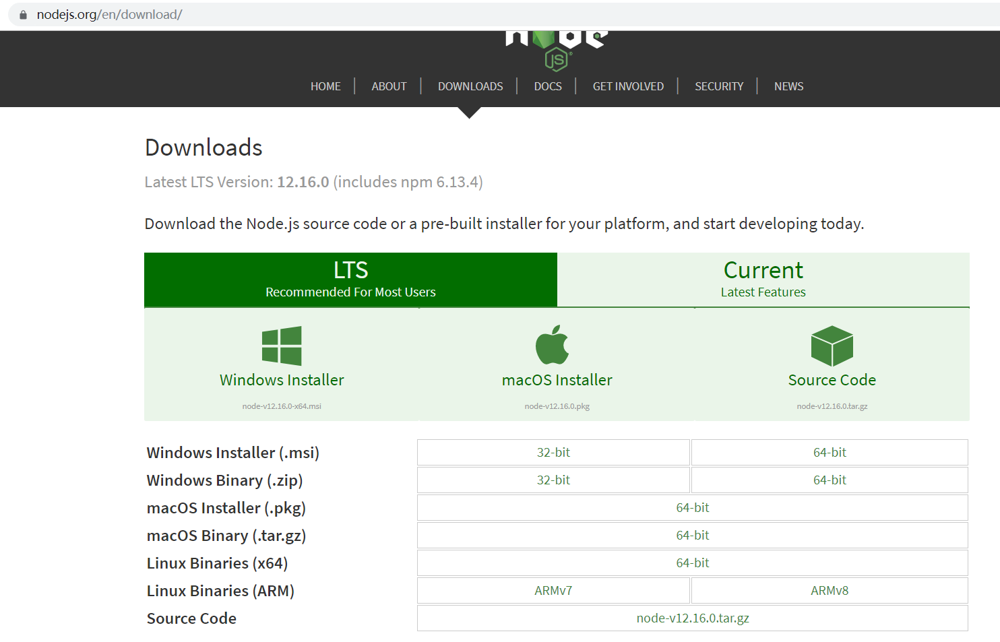
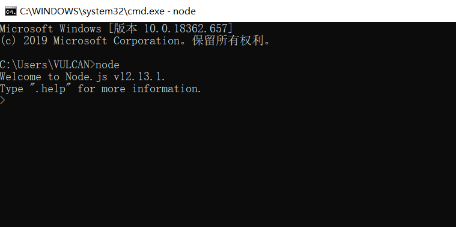
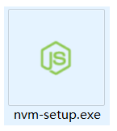
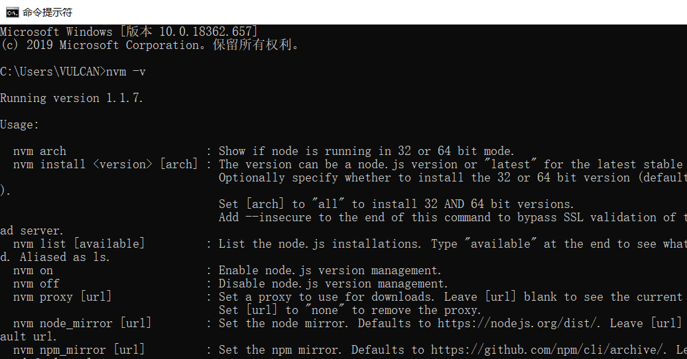
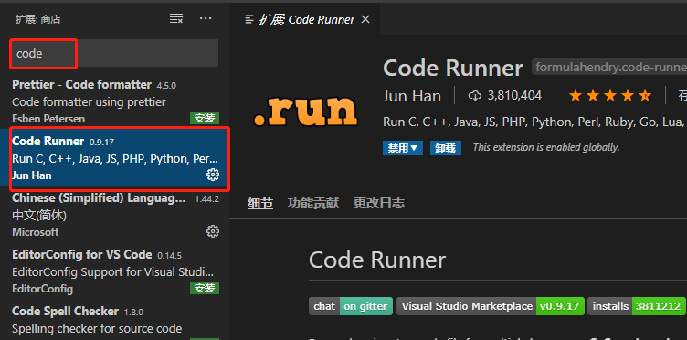
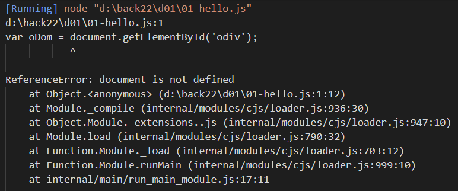

## 一、Node简介

#### 1.1、为什么学习Node(了解)

企业需求

增加自身职业竞争力

进一步理解 Web开发，并有助于明白后端开发

大前端必备技能

为了更好的学习前端框架

... ...

#### 1.2、Node是什么

Node.js®是基于 Chrome的V8 JavaScript 引擎构建的JavaScript运行环境。

Node.js不是新语言，也不是一个框架或者一个库，而是一个软件。

Node.js是一个 JavaScript 运行环境 ，说白了，就是用来运行js的。

官网：<https://nodejs.org/en/> 

中文官网：<https://nodejs.org/zh-cn/> 


#### 1.3、Node能做什么(目前先仅做了解)

Node 打破了过去 JavaScript 只能在浏览器中运行的局面。前后端编程环境统一，大大降低了前后端语言切换的代价。以下是Node可以实现的工作：（仅作了解）

- Web 服务器
- 命令行工具
- 网络爬虫
- 桌面应用程序开发（[Electron](https://electronjs.org/)）
- app
- 嵌入式
- 游戏
- ......

#### 1.4、安装Node

官网：<https://nodejs.org/en/> 

中文官网：<https://nodejs.org/zh-cn/> 




win键+R键打开命令行窗口




输入node进入以上模式表示node安装成功。


## 二、使用Node执行js代码的两种方式

#### 2.1、方式1：交互模式(repl模式) 仅作了解

win键+R键打开命令行窗口，输入node，即进入交互模式。在这个模式下可以输入js代码直接回车执行


#### 2.2、方式2：解释js文件

书写一个hello.js文件


在黑窗口中输入node 01-hello.js回车如下图。


这种方式的含义是：利用node来解释js代码。（所以说node是js代码的解释器，或者运行环境）

#### 2.3、总结

问题：现在，javascript可以运行在哪里？？

1、浏览器

2、node环境下

## 三、Nvm的安装和初步使用

从上一节我们知道，NodeJS有太多的版本了，切记，并不是新版本一出现，旧的版本就不去用了。

在不同的项目开发过程中，可能需要我们在电脑中同时存在多个不同版本的Node。

这时候就需要一个软件，来更好地管理这些不同版本地Node存在我们地电脑中，Nvm就是这样一个软件


nvm （node.js  version  manager 的简写）翻译过来 nodejs 版本管理器。

C:\Users\VULCAN\AppData\Roaming\nvm

#### 3.1、安装Nvm

nvm下载链接  https://github.com/coreybutler/nvm-windows/releases



**！！！注意：如果电脑之前安装过nodejs，请先卸载nodejs后再进行安装。**

**先卸载nodejs:**

控制面板 => 程序和功能 => 找到Node.js这一项，   右键卸载。

再手动打开C:\Program Files目录，看看nodejs文件夹是不是真的被删除了。如果nodejs还存在，就手动删除掉。

**安装nvm:**

双击nvm-setup.exe文件，开始安装。

指定 nvm 安装目录，保持默认目录不变。

指定 nodejs 安装目录，保持默认目录不变。

一直下一步，直到安装成功。

**检测nvm是不是安装成功了:**

成功安装后，新开一个 cmd 窗口，输入 `nvm -v` 如果看到下面的信息，代表安装成功！



**配置nvm:**

复制下面两句话到nvm的安装目录(C:\Users\XXXX\AppData\Roaming\nvm)下的settings.txt的最后。

(目的是加快后面下载nodejs的速度)

```
node_mirror: https://npm.taobao.org/mirrors/node/
npm_mirror: https://npm.taobao.org/mirrors/npm/
```


#### 3.2、nvm命令

- nvm version：           查看 nvm 的版本
- nvm list：              查看当前安装的 Node.js 所有版本   (常用)
- nvm install 版本号 [架构]：    安装指定版本的 Node.js  (常用)
- nvm uninstall 版本号：  卸载指定版本的 Node.js
- nvm use 版本号：        选择指定版本的 Node.js     (常用)

```
# 安装指定版本
nvm install 10.15.0 

# 安装最新版本
nvm install latest

# 使用安装的这个版本10.15.0
nvm use 10.15.0
# 查看node版本
node -v
```


## 四、VScode中执行js代码

安装扩展Code Runner，




## 五、Node的注意事项(了解)

1、nodejs ： ECMAScript + 核心的api(重点) . 没有 DOM、 BOM

```js
var oDom = document.getElementById('odiv');     

console.log(oDom);

var url = location.href;

console.log(url);

以上代码会报错！
```



2、nodejs 提供了文件操作系统(fs)，还提供了 web 服务的功能(http)，即使用nodejs可以编写一个web服务器（这两点在这先知道即可，后面我们会详细讲到）


## 六、ES6语法的简介

浏览器：javascript 三个部分： ECMAScript  +  BOM  + DOM
服务器：javascript = ECMAScript + 系统内置的核心模块(fs http)

ECMAScript 是什么？
是一个 规范。 ECMA 是一个组织协会，协会专门负责制定各种规则。他们制定了一个 ECMAscript 规范，规定脚本语言实现。变量声明 var  function fnName
有哪些语言实现这个规范： 1. JavaScript  2.  actionScript（flash 动画 flash小游戏）

发展过程中 js 有很多的版本的迭代
我们前面学习的版本 ECMAscript5 版本

现在学习 ECMAScript6版本，也叫做es6版本。引入了很多新的语法特性。例如使用 let 声明变量 const 声明常量。


## 七、var的弊端及let关键字

使用var关键字声明变量的弊端：

1、var声明的变量有预解析，造成 逻辑混乱，可以先使用，后声明

2、var可以重复定义同一个变量，逻辑错误，第二次应该是修改变量，而不是定义

3、var用在for循环条件中，造成for 循环的污染的问题

4、var 声明的变量没有块级作用域（ES5中的作用域：全局和局部）

```
// 1、var声明的变量有解析，造成 逻辑混乱，可以先使用，后声明
// var a = 10;
// console.log(a);

// 2、var可以重复定义同一个变量，逻辑错误，第二次应该是修改变量，而不是定义
// var a = 10;
// var a = 30;
// console.log(a);

// 3、var用在for循环条件中，造成for 循环的污染的问题
// for(var i=0; i<10; i++){
//     console.log(i);
// }
// console.log("=====================");
// console.log(i);

// 4、var 声明的变量没有块级作用域（ES5中的作用域：全局和局部）
// {
//     var b = 200;
// }
// console.log(b);
```

上面这些弊端，都在 ES6中的let关键字中得到解决：

```

// console.log(a);   //报错
// let a = 10;

// let a = 10;
// let a = 30; //报错


// for(let i=0; i<10; i++){
//     console.log(i);
// }
// console.log("=====================");
// console.log(i);    //报错


{
    let b = 200;
}
console.log(b);   //报错

```

所以，let的特点：

1、let声明的变量没有预解析，不会有变量提升

2、let不可以重复定义同一个变量

3、let用在for循环条件中，不会造成for 循环的污染的问题

4、let声明的变量有块级作用域（ES6中的作用域：全局和局部还有块级作用域）


## 八、用const定义常量

1、const用来定义常量，修改就会报错
2、我们约定俗成地把常量都命名为大写
3、对象型常量中的属性可以修改
4、数组型常量中的每一项数据的引用可以修改

```js
// var PI = 3.141592653;
//
// console.log(PI);
//
// PI = 3.5;   //不符合我们认知，因为π是个定值
// console.log(PI);
//----------------------------------------------------
// const PI = 3.141592653;   //定义PI常量
// PI = 3.5;    //报错

//----------------------------------------------------
// const OBJ = {
//     name: "nodejs",
//     age:11,
//     email:"nodejs@163.com"
// };
//
// // OBJ = {};  //报错
//
// OBJ.job = "nodejs@qq.com";  //可以修改成功
// console.log(OBJ);   //{ name: 'nodejs', age: 11, email: 'nodejs@qq.com' }
//----------------------------------------------------

const ARR = [10, 0, 30];
ARR[1] = 20;
console.log(ARR);   //[ 10, 20, 30 ]
```

## 九、解构语法

#### 9.1、对象解构

```js
let obj = {
    name: "nodejs",
    age:11,
    email:"nodejs@163.com"
};

// 取出所有属性并赋值：
// let name  = obj.name;
// let age  = obj.age;
// let email  = obj.email;

// 现在只需要(等效于上面的写法):
// let {name, email, age} = obj;  //{ }中的变量名和obj的属性名一致   完全解构

// 部分解构
// let {name} = obj;     // 部分解构

//解构之后重命名   
let {name:itsName} = obj;     解构之后重命名为itsName

```

#### 9.2、数组解构

```js
let arr1 = [10, 20, 30];

let [a, b, c] = arr1;

console.log(a);  //10
console.log(b);  //20
console.log(c);  //30

// 部分解构
let [d] = arr1;
console.log(d);  //10

let [ , ,f] = arr1;
console.log(f);  //30


// 复合解构
let arr2 = [1, 2, [10, 20, 30]];
let [ j, k, [x, y, z]] = arr2;
console.log(j);  //1
console.log(k);  //2
console.log(x);  //10
console.log(y);  //20
console.log(z);  //30
```

#### 9.3、字符串解构

```js
let string1 = "xyz";

let [a,b,c] = string1;
console.log(a);  //x
console.log(b);  //y
console.log(c);  //z


string1[1] = "Y";
console.log(string1);  // xyz    无法修改
console.log(string1[1]);  // y
```

## 十、模板字符串

```js
var userInfo = {
    id: 1,
    name: 'andy',
    email: 'gogery@163.com'
}

// 需求：希望把对象拼接为字符串： the userId is xxx, my name is xxx, my email is xxx;

/*var tmpl = 'the userId is '
    + userInfo.id + ', my name is '
    + userInfo.name + ', my email is '
    + userInfo.email;

console.log(tmpl);*/


var es5tpl = 'the userId is xxx, my name is xxx, my email is xxx';


// es6 提供一个语法表示一个字符串，使用的标识符是 反引号；
// 以前定义字符串使用的： '' ""
// 1. 允许换行 2. 允许在模板字符串里面直接使用变量
var infos = 'lorem';

var tmpl = `the userId is ${userInfo.id}, 

my name is ${userInfo.name},

string is ${infos}
 
 my email is ${userInfo.email}`;
// `` 反引号 数字键 1旁边的键，需要是 shift  + `
console.log(tmpl);
```

## 十一、es6对象的简化写法

```js
/*var name = 'andy';
var age = 12;

var userInfo = {
    id: 1,
    name: name,
    age: age
}

console.log(userInfo);*/

let id = 12;
let name = 'andy';
let age = 12;

let fn = function(){
    console.log(`my name is ${this.name}` );
}

// es6 写法
let userInfo = {
    id,
    // 如果我们的变量的名称和属性的名称一致，则可以直接只写变量名
    name, // name: name
    age,
    fn // 如果我们的函数的名称和属性的名称一致，直接写函数名即可
}

console.log(userInfo);
userInfo.fn();
```

## 十二、ES6其他注意事项

注意： es6 语法特性如果是在nodejs的高版本执行没啥问题，高版本支持 es6；

如果是nodejs 低版本 4 5 不支持
es6（ECMAScript6  ECMAScript2015） 除了可以在nodejs 也可以在浏览器执行
注意：浏览器高版本才可以执行， 如果是 IE 678 肯定不认识，直接报错。


需求：es6 写起来很爽，很方便，浏览器并不能全部支持。如何解决呢？
使用 babel 翻译器
考拉 less sass---考拉--- css
es6----babel---es5（基本所有的浏览器全部支持）

在线编译网址：

https://www.babeljs.cn/repl

