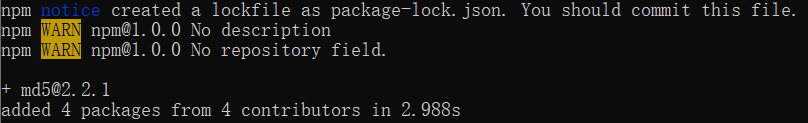
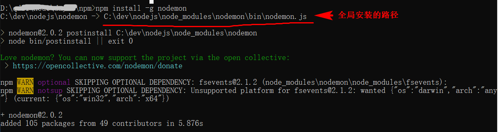
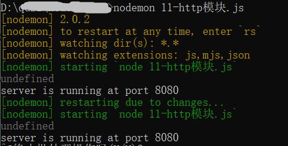

## http模块

#### http核心模块的使用

四个步骤：

导入http模块

定义服务器程序端口

创建服务器对象

调用服务器的监听方法，让服务器监听浏览器请求

```js
const http = require("http");
const port = 8080;

const server = http.createServer((request, response)=>{
    response.write("hello nodejs"); 
    response.end()   
});

server.listen(port,(error)=>{
    console.log(error);
    console.log(`server is running at port ${port}`);
});
```

#### 获取请求的一些信息

```js
const url = require("url");

const server = http.createServer((request, response)=>{
    console.log("------------------------------");
    let requestUrl = request.url;  // 获取本次请求的资源路径
    console.log(requestUrl);

    let method = request.method;  // 获取本次请求的方式
    console.log(method);

    let obj = url.parse( requestUrl, true);
    console.log(obj.query);    // 获取get请求的查询字符串    
    //  localhost:8080?name=nodejs&age=11   get请求

    //当存在 post 提交数据 data 事件立马执行，postData就是提交过来的数据对象
    request.on('data',(postData) => {   // 获取post请求的请求参数
        console.log(postData.toString());
    });

    response.write("hello nodejs");  // 书写响应体内容
    response.end()   //发生响应到浏览器  当我们修改代码后，需要重新执行该文件，重启服务
});
```

#### 书写一个web服务器

```js
const http = require("http");
const fs = require("fs");
const path = require("path");


const server = http.createServer((request, response)=>{

    let requestUrl = request.url;
    console.log(requestUrl);
    if(requestUrl==="/" || requestUrl==="/index.html"){
        let content = fs.readFileSync(path.join(__dirname,"assets","html","index.html"));
        response.end(content)
    }
    else if(requestUrl==="/login.html"){
        let content = fs.readFileSync(path.join(__dirname,"assets","html","login.html"));
        response.end(content)
    }
    else if(requestUrl.indexOf(".css") > -1){
        let content = fs.readFileSync(path.join(__dirname,"assets","css",requestUrl));
        response.end(content)
    }
    else if(requestUrl.indexOf(".js") > -1){
        let content = fs.readFileSync(path.join(__dirname,"assets","js",requestUrl));
        response.end(content)
    }
    else{
        response.end("404 NOt Fround:找不到该页面")
    }

});

const port = 8080;

server.listen(port,(error)=>{
    console.log(error);
    console.log(`server is running at port ${port}`);

});
```


## npm简介

`npm` 全称为 `Node Package Manager`，是一个基于 `Node.js` 的包管理器，也是整个 `Node.js` 社区最流行、支持的第三方模块最多的包管理器。npm的初衷：JavaScript开发人员更容易分享和重用代码。

nodejs = ECMAScript + 核心模块

自己遵循 commonjs 规范写出模块，如果写的是功能模块（日期处理datejs，数字处理numberjs）。如果可以把这些模块分享出来，以后谁要进行相关功能开发的时候，直接拿开发好的模块使用即可，没必要自己在开发。在互联网有一个网站专门收集这样的工具包。https://www.npmjs.cn/。

如果我们要使用这个网站里面的包，则我们需要使用一个功能，叫做 npm。

官网：https://www.npmjs.cn/

<https://www.npmjs.com/package/md5> 

npm可以用来：

- 允许用户获取第三方包并使用
- 允许用户将自己编写的包或命令行程序进行发布分享

**npm安装：**

`npm`不需要单独安装。在安装 `Node` 的时候，会连带一起安装`npm`。

执行下面的命令可以用来查看本地安装的 npm 的版本号。

```bash
npm -v
```

如果想升级 npm ，可以这样

```bash
npm install npm --global
```

## npm体验

以安装和使用md5模块为例：

项目目录下，执行命令 npm init，目录下会多一个package.json文件(这个文件1、记录项目相关信息，如项目名称，项目版本2、后期会记录项目中使用的第三方模块)

项目目录下，执行命令 npm install md5，这时候就会开始联网下载md5这个包，下载过程需要耐心等待，等待时间视网速而定。

看见以下代码表示下载完成：



下载完后：本地项目目录下多了一个node_modules文件夹，我们刚才所下载的md5包及其相关依赖包都在这个文件夹里面了。以后我们开发中需要下载其他包，都会在下载在这个文件夹中。

下载完就可以在项目中去导入然后使用了：

```js
var md5 = require('md5');
console.log(md5("12345789"));
```


## 小练习

实现一个，数字转大写的功能      如：  123    转   壹佰贰拾叁

在  https://www.npmjs.com  上搜索功能关键字

找对应可能用上的包，参考文档，进行安装，使用


## nodemon包的使用

下载：npm install -g nodemon 



安装成功，项目目录下，通过命令**nodemon 11-http模块.js**启动服务器即可。




