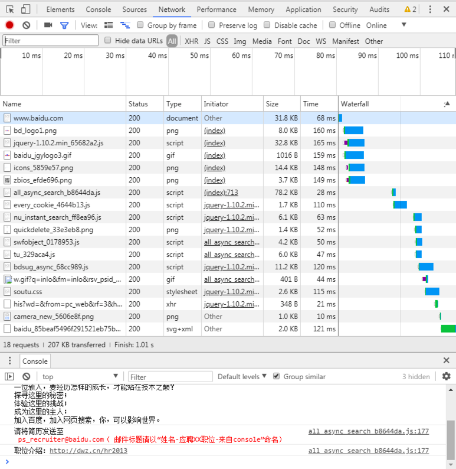
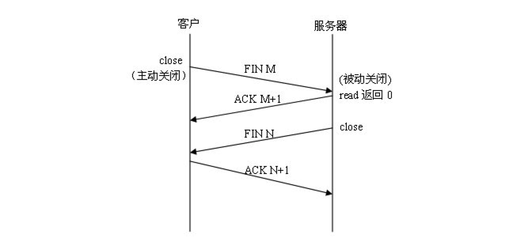
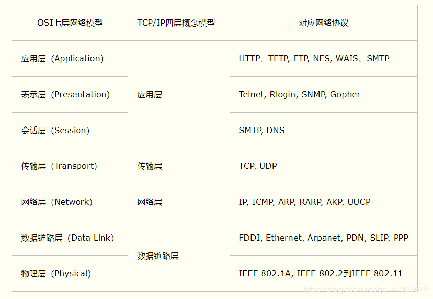

## 一、异步终极方案 async+await

#### 1.1、async+await基本结构

之前我么写过类似一下的代码：

```js
function func(a, b) {
    return a + b
}

let ret = func(10, 30);
let ret1 = func(50, 320);
let ret2 = func(1560, 30);
let ret3 = func(10, 3560);
console.log(ret + ret1 + ret2 + ret3);
```

如果Promise对象也能有对应的方式来接收，写成类似：

```js
let data1 = await readfilePromise;  // 直接获取成功的数据
```

async的最终格式如下：

```js
async function func() {
    let data1 = await promise对象1;
    let data2 = await promise对象2;
    let data3 = await promise对象3;
}
// 相当于让异步函数对象1先执行完毕之后，再执行异步函数对象2，再执行异步函数对象3
```

案例见 2.5

#### 1.2、注意事项

1. 如果await后面只写一个基本数据类型，会这个基本数据类型进行包装，包装成一个 Promise 对象

```js
async function func() {
    let data1 = await 123;
    //1. await后面只写一个基本数据类型 会这个基本数据类型进行包装，包装成一个 Promise 对象
    // 即data1相当于： new Promise((resolve,reject)=>{resolve(123)})

    console.log("data1:", data1);   //data1: 123

    return data1
    // return await data1

}

let a = func();

a.then((data)=>{
    console.log(data);  //123  接收到上面的返回值Promise对象的执行结果
});
```

2. 如果await后面是一个 Promise，会把 resolve 的值返回
3. async 函数里面的 await 是异步的，不是同步

```js
async function func() {
    console.log("start-------");
    let data1 = await readFile(filePath1, "utf-8");
    console.log("end-----------");
    let data2 = await readFile(filePath2, "utf-8");
    let data3 = await readFile(filePath3, "utf-8");

    console.log(data1+data2+data3);
}

console.log("start");
func();
console.log("end");

//输出结果依次为：
//start
//start-------
//end
//end-----------
```

4. 错误处理(外部处理)

```js
async function func() {
    let data1 = await readFile(filePath1, "utf-8");
    let data2 = await readFile(filePath2, "utf-8");
    let data3 = await readFile(filePath3, "utf-8");

    console.log(data1+data2+data3);

    // writeFile(filePath4, data1+data2+data3)
}

func().catch( error => {
    console.log(error);
} ).finally(()=>{
    console.log("finally");
});
```

5. 错误处理(内部处理)

```js
async function func() {
    try{
        let data1 = await readFile(filePath1, "utf-8");
        let data2 = await readFile(filePath2, "utf-8");
        let data3 = await readFile(filePath3, "utf-8");
    }
    catch (error) {
        console.log(error);
        return
    }
    finally {
        console.log("finally");
    }

    console.log("end");
}

func();
```

## 二、浏览器访问网站的基本过程

 1、 基本流程
        用户输入网址，
        浏览器请求DNS服务器, 获取域名对应的IP地址，
        请求连接该IP地址服务器，
        发送资源请求报文. (遵循HTTP协议)
        web服务器接收到请求, 并解析请求, 判断用户意图，
        获取用户想要的资源，(链接数据库从数据中获取数据)
        将资源返回给http服务器程序，
        http服务器程序将资源数据通过网络发送给浏览器 （响应给浏览器），发送响应报文
        浏览器解析呈现请求的数据

2、 域名与域名服务器
   	1、网站： www.sina.com.cn
        	-www: 主机名 ，ftp、svn、stmp、xmpp服务
        	- sina：机构名
                	- com：机构类型
                	- cn： 国家名  tw  hk   us  uk  jp 

   	2、域名服务器（DNS）    

​		存放域名与ip对应的服务器

## 三、Http协议简介

> HTTP协议就是**超文本传输协议**(HyperText Transfer Protocol),通俗理解是浏览器和web服务器传输数据格式的协议,HTTP协议是一个应用层协议。
>
> HTTP协议是**基于TCP协议**的，发送数据之前需要建立好连接
>
> HTTP是万维网的数据通信的基础。设计HTTP最初的目的是为了提供一种发布和接收HTML页面<网页>的方法。
>
> HTTP协议的制作者是**蒂姆·伯纳斯-李**，他供职于CERN(欧洲核子研究组织)
>
> - 1991年发布的0.9版，该版本极其简单，只有一个GET请求方法
> - 1996年5月，HTTP/1.0版本发布
> - 1997年1月，HTTP/1.1版本发布，目前使用就是HTTP/1.1版本


1、 http的认识
        1.1、什么是协议
           协议就是双方之间的一种约定、一种规则；按照此约定、规则，双方就可以顺畅的、有条不紊的进行交流和通信
	1.2、http协议
       		1、http： 超文本传输协议(hypertext transfer protocol) :用于web服务器与浏览器之间传输网页数据的协议
        	2、http协议基于tcp/ip协议基础上

   	1.3、页用html(超文本标记语言)语言来编写   html5

2、 http协议的请求响应模型
 	包含浏览器与http服务器的request、response请求响应模型

## 四、http请求报文格式

1、请求行[请求方法 资源路径 版本\r\n]  GET /index.html HTTP/1.1\r\n
2、请求头[头名: 头值\r\n]    Host: localhost 
3、空行  [\r\n]     "\r\n"
4、请求体[浏览器给服务器发送的数据(POST提交的数据)]     

注意：记住以上格式即可，**不需要背诵请求头中的属性**

以下有几个版本的请求头，仅做了解，可以看一看：

```
1、 普通请求版本:
            GET / HTTP/1.1      请求行

                请求方式:
                    GET    浏览器仅仅只是获取网页数据
                    POST   客户端向服务器提交数据
                请求的资源路径： /     (也有可能是 /index.html  /xxx.jpg   /xx/xx/xx.jpg)    
                协议的版本号： HTTP/1.1   

            Host: 127.0.0.1:8080      请求头
                主机域名  www...
            Connection: keep-alive
                连接方式：长连接
            Upgrade-Insecure-Requests: 1
                支持升级为https，更安全协议
            User-Agent: Mozilla/5.0 (Windows NT 10.0; WOW64) AppleWebKit/537.36 (KHTML, like Gecko) Chrome/73.0.3683.86 Safari/537.36
                用户代理：浏览器相关信息，客户机相关信息
            Accept: text/html,application/xhtml+xml,application/xml;q=0.9,image/webp,image/apng,*/*;q=0.8,application/signed-exchange;v=b3
                浏览器可以接受的数据类型
            Accept-Encoding: gzip, deflate, br
                浏览器接收的编码方式
            Accept-Language: zh-CN,zh;q=0.9,en;q=0.8
                浏览器接受的语言类型
```

```
2、 有请求体版本：
            POST / HTTP/1.1
            Host: localhost:8080
            Connection: keep-alive
            Content-Length: 41
            Cache-Control: max-age=0
            Upgrade-Insecure-Requests: 1
            Origin: null
            Content-Type: application/x-www-form-urlencoded
            User-Agent: Mozilla/5.0 (Windows NT 10.0; WOW64) AppleWebKit/537.36 (KHTML, like Gecko) Chrome/73.0.3683.86 Safari/537.36
            Accept: text/html,application/xhtml+xml,application/xml;q=0.9,image/webp,image/apng,*/*;q=0.8,application/signed-exchange;v=b3
            Accept-Encoding: gzip, deflate, br
            Accept-Language: zh-CN,zh;q=0.9,en;q=0.8

            username=laozhuang&password=sasjdnflkjdsg    请求体    客户端提交的数据
```

## 五、http协议响应报文格式

1、响应行[版本 状态码 说明\r\n]   必须有，HTTP/1.1 200 OK\r\n
2、响应头[头名: 头值\r\n]   Content-Type: text/html;charset=utf-8\r\n     Server: BWS/1.1\r\n
3、空行[\r\n]   "\r\n"
4、响应体[html文本或者资源数据, 即网页内容]

注意：记住以上格式即可，**不需要背诵响应头头中的属性**

```
		HTTP/1.1 200 OK      响应行

            协议版本  HTTP/1.1
            状态码   
                2xx 成功  200 OK
                3xx 重定向 
                4xx 客户端错误 404 Not Found
                5xx 服务器错误 503 Service Unavailable

            状态说明
            HTTP
        Cache-Control: private       响应头
            缓存控制命令
        Content-Encoding: gzip
            相应的内容是压缩的，通过gzip
        Content-Type: text/html;charset=utf-8
            响应体的类型：网页编码utf-8
        Date: Fri, 06 Apr 2018 09:05:27 GMT
            日期 东八区时间 
            服务器回复响应报文的时间 -- 格林威治时间
        Server: BWS/1.1
            服务器名称
        分割符"\r\n"         空行
        网页内容     响应体
```

响应行的常见状态码(了解)：
            200： 请求成功
            404： 请求的资源没有存储
            505： 服务器内部发生错误
            307(http1.1)/302(http1.0)： 网页发生转移

## 六、谷歌浏览器开发者工具的使用（掌握！）



- 元素(Elements):用于查看或修改HTML元素的属性、CSS属性、监听事件、断点等.
- 控制台(Console):控制台一般用于执行一次性代码, 查看JavaScript对象, 查看调试日志信息或异常信息.
- 源代码(Sources):该页面用于查看页面的HTML文件源代码、JavaScript源代码、CSS源代码, 此外最重要的是可以调试JavaScript源代码, 可以给JS代码添加断点等.
- 网络(Network):网络页面主要用于查看 header 等与网络连接相关的信息.

**注意**: **Network 中的每一项就是一次请求/响应过程, 点击每一项, 可查看本次请求响应的报文信息.**

## 七、TCP/IP模型    三次握手四次挥手（了解）

http协议是基于TCP/IP协议的，TCP/IP协议是一个可靠的传输协议。

浏览器(客户端)和服务器**建立**连接的时候，发生三次握手：


浏览器(客户端)和服务器**断开**连接的时候，发生四次挥手：




## 八、OSI七层模型(了解)

七层模型，亦称OSI（Open System Interconnection）。参考模型是国际标准化组织（ISO）制定的一个用于计算机或通信系统间互联的标准体系，一般称为OSI参考模型或七层模型。 

说白了，就是两台计算机之间进行通信的时候，经历了哪些工作。

 