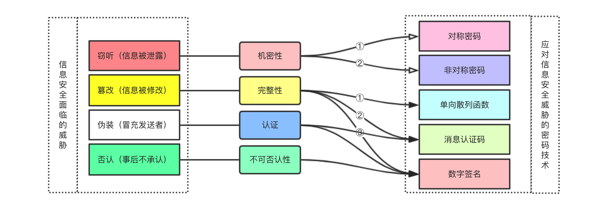

# 加密

在密码学中，加密（英语：Encryption）是将明文信息改变为难以读取的密文内容，使之不可读的过程。只有拥有解密方法的对象，经由解密过程，才能将密文还原为正常可读的内容。

虽然加密作为通信保密的手段已经存在了几个世纪，但是只有那些对安全要求特别高的组织和个人才会使用它。在 1970 年代中期，“强加密”（Strong Encryption）的使用开始从政府保密机构延伸至公共领域，并且当前已经成为保护许多广泛使用系统的方法，比如因特网电子商务、手机网络和银行自动取款机等。

# 术语

- 明文 | 原文（plaintext）：基于安全方面的考量，在开发中进行数据交互的时候通常我们会对一些敏感的用户隐私数据进行加密处理，需要进行加密的消息我们称为明文或者是原文。
- 密文（ciphertext）：采用特定方式对明文 | 原文加密之后得到的结果称为密文。
- 加密（encrypt）：加密是一种对明文的特定处理方式，对明文加密之后可以得到对应的密文，加密的方式和结果取决于特定的加密算法。
- 算法（algorithm）：用于解决（复杂）问题的特定步骤，通常称为算法。算法为我们提供了一条解决问题的特定路径，解决同一个问题可以有多种不同的算法。
- 加密算法（encrypt-algorithm）：从明文生成密文的具体步骤，也就是加密的特定步骤我们称为加密算法。
- 解密（decrypt）：解密是一种对密文的特定处理方式，对密文解密之后可以得到对应的明文。所以，解密指的是根据密文得到原文的过程。
- 解密算法（decrypt-Algorithm）：从密文还原出明文|原文的具体步骤，也就是解密的特定步骤我们称为解密算法。
- 密码算法：等于加密算法 + 解密算法。  
- 密钥（key）：密钥在很多加密算法中使用，它就好像我们现实生活中的钥匙一样，很多加密算法在加密和解密的时候都需要用到密钥，就好像很多锁在打开和锁起来的时候都需要用到钥匙一样。

# 信息安全性

加密可以用于保证安全性，但是其它一些技术在保障通信安全方面仍然是必须的，尤其是关于数据完整性和信息验证。

# 加密算法

加密算法分：
- 不可逆算法：密码散列函数（英语：Cryptographic hash function），又译为加密散列函数、密码散列函数、加密散列函数，是散列函数的一种。它被认为是一种单向函数，也就是说极其难以由散列函数输出的结果，回推输入的数据是什么。这样的单向函数被称为“现代密码学的驮马”。这种散列函数的输入数据，通常被称为消息（message），而它的输出结果，经常被称为消息摘要（message digest）或摘要（digest）。
- 可逆算法：
    - 对称加密：将信息使用一个密钥进行加密，解密时使用同样的密钥，同样的算法进行解密。
    - 非对称加密：又称公开密钥加密，是加密和解密使用不同密钥的算法，广泛用于信息传输中。